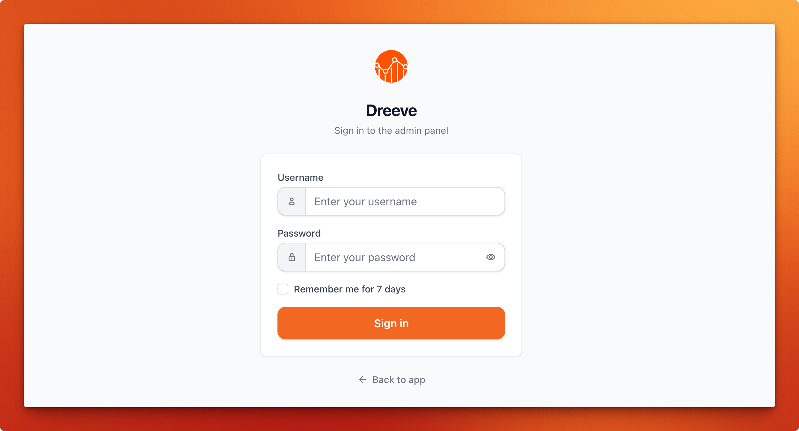

# Installation

> [!NOTE]
> **Note** Make sure to read the <a href="/#/getting-started/prerequisites">prerequisites</a> before you start installing the app.

Start off by showing some :heart: and give this repo a star. Then, from your command line:

```bash
# Create a new directory
> mkdir dreeve
> cd dreeve

# Create docker-compose.yml and copy the example contents into it
> touch docker-compose.yml
> nano docker-compose.yml

# Create .env and copy the example contents into it. Configure as you see fit
> touch .env
> nano .env
```

## docker-compose.yml

```yml
services:
  app:
    # The Dreeve Docker image is available on Docker Hub and the GitHub Container Registry
    image: robiningelbrecht/dreeve:latest
    # image: ghcr.io/dreeveapp/dreeve:latest
    container_name: dreeve
    restart: unless-stopped
    volumes:
      - ./build:/var/www/build
      - ./storage/database:/var/www/storage/database
      - ./storage/files:/var/www/storage/files
      # Drop your .fit/.tcx/.gpx files in ./watch to have them imported.
      - ./watch:/var/www/watch
    env_file: ./.env
    healthcheck:
      test: ["CMD", "curl", "-f", "http://localhost:2019/metrics"]
      start_period: 60s
    ports:
      - 8080:8080
    networks:
      - dreeve-network

  # This container runs the recurring background tasks:
  daemon:
    image: robiningelbrecht/dreeve:latest
    container_name: dreeve-daemon
    restart: unless-stopped
    volumes:
      - ./build:/var/www/build
      - ./storage/database:/var/www/storage/database
      - ./storage/files:/var/www/storage/files
      - ./watch:/var/www/watch
    env_file: ./.env
    healthcheck:
      test: [ "CMD", "sh", "-c", "test -f /var/www/storage/database/dreeve.db && echo 'ok' || exit 1" ]
      start_period: 5s
    command: ['bin/console', 'app:daemon:run']
    networks:
      - dreeve-network

networks:
  dreeve-network:
```

> [!IMPORTANT]
> **Important** Both containers must mount the **same** volumes. They share one database, one build
> directory and one watch folder.

## .env

> [!IMPORTANT]
> **Important** Every time you change the .env file, you need to recreate (for example; `docker compose up -d`) your container for the changes to take effect (restarting does not update the .env).

This is the minimal `.env` to get started.

```bash
# Either "files" (default) or "stravaApi".
# See https://docs.dreeve.app/#/importing/overview
IMPORT_MODE=files

# The URL you will reach the app on. Include the port if you use one.
APP_URL=http://localhost:8080
# Valid timezones can be found under the TZ Identifier column here:
# https://en.wikipedia.org/wiki/List_of_tz_database_time_zones#List
TZ=Etc/GMT

# Used to sign the admin session cookie. Set it to any long random string.
APP_SECRET=change-me-to-a-long-random-string

# Admin panel credentials.
ADMIN_USERNAME=admin
# See the "Admin password" section below.
ADMIN_PASSWORD_HASH='replace-me'

# Takes a comma-separated allowlist. When it is set, requests to /admin* from any other IP are rejected.
# ADMIN_ALLOWED_IPS=192.168.1.10,192.168.1.11

# Only needed when IMPORT_MODE=stravaApi.
# See https://docs.dreeve.app/#/importing/strava-import
# STRAVA_CLIENT_ID=
# STRAVA_CLIENT_SECRET=
# STRAVA_REFRESH_TOKEN=

# Uncomment and set these to run the container as a non-root user.
# PUID=your host UID
# PGID=your host GID

# !! IMPORTANT If you want to serve Dreeve via a reverse proxy, 
# uncomment the following lines and configure them accordingly:

# The domain where Dreeve will be available.
# PROXY_HOST=https://your-domain.com
# The port on which the app will be served.
# PROXY_PORT=8080
```

## Admin password

Dreeve's admin panel is where you configure everything, so you need to be able to log into it.
`ADMIN_PASSWORD_HASH` holds a **bcrypt hash** of your password, not the password itself.

The command that generates the hash runs *inside* the container, so start the containers first and leave
`ADMIN_PASSWORD_HASH` empty for now:

```bash
> docker compose up -d
> docker compose exec app bin/console security:hash-password
```

Use the **interactive prompt**.

> [!CAUTION]
> **Caution: you must double every `$` in the hash.** Docker Compose performs variable interpolation on
> `.env` values, so it reads `$bHxkUSQsf...` as a variable, finds nothing, and silently drops it.

So a hash of:

```
$2y$13$bHxkUSQsfOt1T.dqbu8g4u/H6EXruv.lPUrwi.4NEGdkrKslTDAqW
```

goes into your `.env` as:

```bash
ADMIN_PASSWORD_HASH=$$2y$$13$$bHxkUSQsfOt1T.dqbu8g4u/H6EXruv.lPUrwi.4NEGdkrKslTDAqW
```

## Running the application

Now that `.env` is complete, recreate the containers so they pick up your password hash:

```bash
> docker compose up -d
```

The docker container is now running; navigate to http://localhost:8080/ to access and set up the app.
You should be redirected to the admin panel login page.

