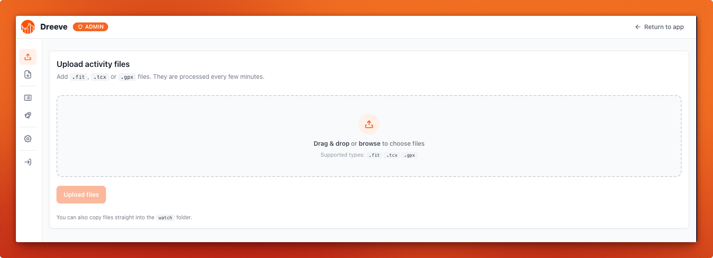
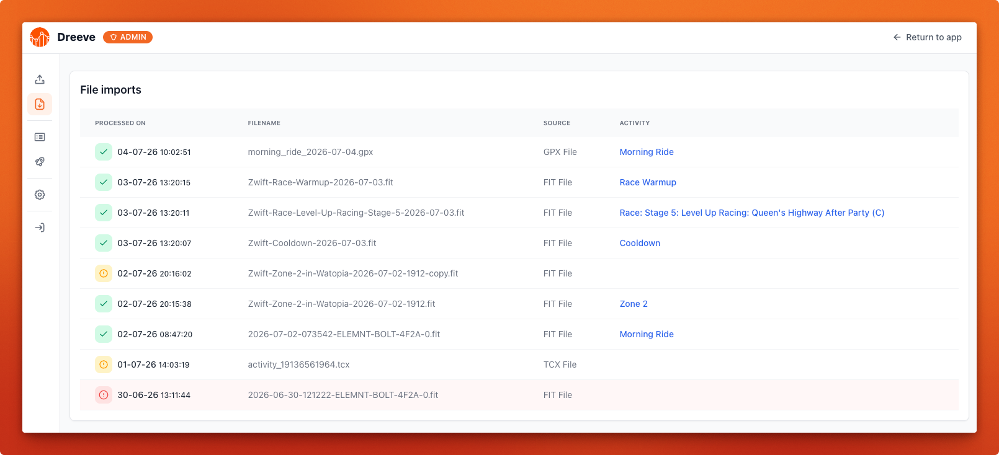

# File import

This is Dreeve's default mode (`IMPORT_MODE=files`).

## Supported file types

| Extension | Notes |
|---|---|
| `.fit` | The richest format. Produced by most Garmin, Wahoo and Zwift devices. Contains streams, laps, power, heart rate. |
| `.tcx` | Contains streams and laps. |
| `.gpx` | Route data. Contains the least detail of the three. |

## Uploading files

### The watch folder

Drop files into the `watch/` folder that you mounted in your
[docker-compose.yml](/getting-started/installation.md#docker-composeyml). On the next import run, everything in
it is processed.

### Upload in the browser

Go to `/admin/upload` in the admin panel and drag your files in. This is the easiest route if the machine
running Dreeve isn't the machine your files are on. Uploaded files go through the same pipeline as the "watch folder" approach.



### Duplicate detection

Dreeve checks incoming activities against what it already has imported before. So re-importing a file, or dropping in a bulk
export that overlaps with what you've already loaded, won't create duplicates. Duplicates are silently skipped
and recorded in the import log as `skipped`.

## Running an import

The [daemon](/importing/scheduling.md) container will notice the files and import them on its
own every 5 minutes. To trigger a run yourself:

```bash
> docker compose exec app bin/console app:cron:run-file-import --import --build
```

## The import log

Every processed file is recorded at `/admin/file-imports`, with one of three outcomes:

| Outcome | Meaning |
|---|---|
| `success` | The activity was imported. The row links to it. |
| `skipped` | The activity was already in your database. |
| `failed` | The file could not be parsed. The row carries the error message. |


