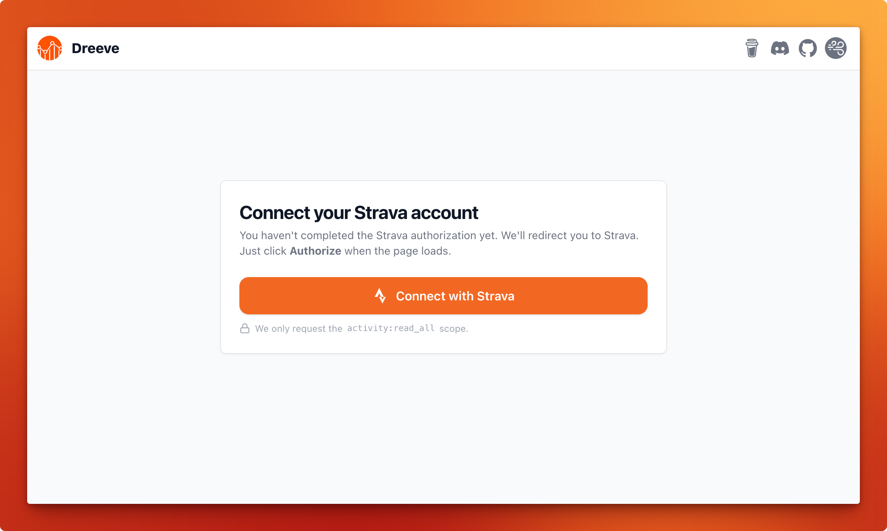

# Strava import

Instead of supplying files yourself, Dreeve pulls your activities
straight from the Strava API, and gets a few things that only Strava has: segments, segment efforts,
challenges and trophies.

To use it, set:

```bash
IMPORT_MODE=stravaApi
```

## Prerequisites

> [!WARNING]
> **Paid Strava subscription required.** As of June 1st, 2026 Strava requires an active paying
> subscription to use the Strava API. Without one you will not be able to import your activities in
> `stravaApi` mode. If you don't have a subscription, use the default [`files` mode](/importing/file-import.md) instead.

You need a Strava account, and a **Strava API application** to get a `client ID` and `client secret`.

* Navigate to your [Strava API settings page](https://www.strava.com/settings/api).
* Copy the `client ID` and `client secret`, these go into your `.env`.
* Make sure the `Website` and `Authorization Callback Domain` are set to the URL you host the app on.
  You can configure these with the __Edit__ button on the top right-hand side of the page.
* Add an App Icon. You'll find this setting at the bottom of the API settings page.

> [!IMPORTANT]
> **Important** Do not include a port number in the _Authorization Callback Domain_ field.


### Map visibility

To see maps of your activities in the app, your Strava map visibility settings have to allow it.
Go to your [Strava account settings](https://www.strava.com/settings/privacy)
and make sure <i>Hide your activity maps from others completely</i> is **not** enabled.


## Configuration

Add your credentials to `.env`. Leave `STRAVA_REFRESH_TOKEN` as-is for now, you obtain it in the next step.

```bash
IMPORT_MODE=stravaApi

STRAVA_CLIENT_ID=YOUR_CLIENT_ID
STRAVA_CLIENT_SECRET=YOUR_CLIENT_SECRET
# Obtained through the app's OAuth flow, see below. Leave unchanged for now.
STRAVA_REFRESH_TOKEN=replace-me
```

Remember to recreate your containers after editing `.env`. Restarting is not enough.

## Obtaining a Strava refresh token

> [!CAUTION]
> **Caution** Caution Do **not** use the refresh token displayed on your Strava API settings page, it will not work.

The first time you launch the app, you will need to obtain a `Strava refresh token`. 
The app needs this token to be able to access your data and import it into your local database.

Navigate to http://localhost:8080/. You should see this page, just follow the steps to complete the setup.



## Importing

```bash
> docker compose exec app bin/console app:cron:run-strava-import --import --build
```

The first run takes a while. Strava enforces API rate limits and Dreeve deliberately paces itself to stay
inside them, importing a bounded number of activities per run and picking up where it left off next time.

## Import settings

In `stravaApi` mode the admin panel gains an **Import** settings group and allows you to configure:

* **Number of new activities to process per import**: the ceiling per run.
* **Sport types to import**: restrict the import to the sports you care about.
* **Activity visibilities to import**: e.g. skip activities you've marked as private on Strava.
* **Skip activities recorded before**: a cutoff date, so you don't import a decade of history you don't want.
* **Activities to skip during import**: exclude specific activities by id.
* **Opt in to segment detail import**: pull full segment details. Costs extra API calls.
