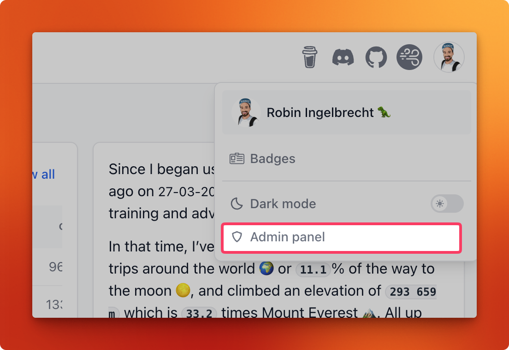

# FAQ

## General

Is Dreeve the same app as "Statistics for Strava"?

Yes. Dreeve was formerly called "Statistics for Strava" and was renamed as the app grew beyond Strava into a
general dashboard for your sports and fitness data. It's the same app, by the same maintainer, 
but the repository moved to [dreeveapp/dreeve](https://github.com/dreeveapp/dreeve).

## Importing & activities

Can I use both import modes at once?

No. `IMPORT_MODE` is either `files` or `stravaApi`, you can switch between them though.

Why is my activity not visible in the app after uploading it?

Almost always one of three things:

1. **The build hasn't run.** Dreeve's frontend is pre-rendered static HTML, so importing an activity does not make
   it appear. A build has to run afterwards.
2. **It was a duplicate.** Dreeve won't import the same activity twice.
3. **It failed to parse.**

Where do my files go after they're imported?

They are **deleted** from `watch/`. That happens whether the import succeeded, was skipped as a duplicate, or
failed. The raw file data is stored in the database though.

## Strava import

Do I need a Strava account?

No. Dreeve's default mode is `files`: you supply `.fit`, `.tcx` or `.gpx` files and everything is parsed
locally. No Strava account, no API application, no keys, no rate limits.

Strava import is fully supported if you want it, see [Importing activities](/importing/overview.md).

Why does it take so long to import my data?

*This applies to `stravaApi` mode only. File import has no rate limits.*

Running the import for the first time can take a while, depending on how many activities you have on Strava.
Strava's API has a `rate limit` of `100 request per 15 minutes` and a `1000 requests per day`.
We have to make sure this limit is not exceeded. See https://developers.strava.com/docs/rate-limits/.
The app makes sure there is enough time between requests to not hit the 15-minute limit.

By default, the app imports up to `250 new activities per run`.
This limit helps ensure that additional metadata can also be fetched without exceeding the daily API rate limit.

You can adjust this value in your `.env` file.
For an initial import where you want to fetch as many activities as possible, set it to _1000_.
If you hit the daily rate limit, the app will automatically import the remaining activities the next day(s).

Can I sync multiple Strava accounts?

No, the app only supports one Strava account at a time. If you want to use multiple Strava accounts,
you will need to run multiple instances of the app, each with its own Strava client ID and secret.

## Admin panel

How do I get to the admin panel?

The **Admin panel** link lives in the frontend app. Click your **profile picture** in the top-right corner to
open the dropdown menu, then choose **Admin panel**.

I can't log in to the admin panel

The usual cause is an unescaped `$` in `ADMIN_PASSWORD_HASH`. Docker Compose treats `$` as the start of a
variable and silently mangles the hash, so you get a password that can never match. Every `$` must be doubled.
See [Admin password](/getting-started/installation.md#admin-password).

